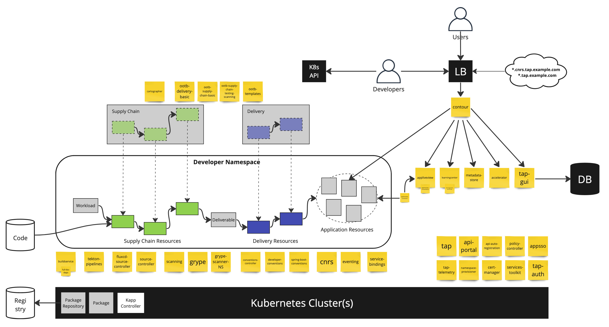

# Architecture

The following sections provide details on the key components and aspects of TAP's architecture:

## Packages
- TAP in installed as `Packages` and `PackageInstalls` which are concepts of Carvel's KApp Controller
- Packages stem from a registry that serves as the package mirror of the instance of TAP
- Each orange sticky in the picture in an installed package that either represents a subservice of TAP, add capabilities to Kubernetes in the form of CRDs or is otherwise necessary to provide TAP's functionality. 

## Developer Namespace
- Each app team get their own namespace and a certain level of access to it
- All steps involved in building, testing, and rolling out the application happen inside this namespace

## Supply Chain
- One or more supply chains are defined for the cluster
- Different supply chains may apply to different types of workloads
- When a user creates a `Workload `resource in Kubernetes, the Supply Chain kicks off and the workload runs through the process
- The supply chain finishes with a `Deliverable` resource
- Supply Chains are unscoped K8s resources. Following the naming rules of K8s they can be found as `ClusterSupplyChain` in the API.
- TAP brings "OOTB" (out-of-the-box) Supply Chains that represent pre-defined definitions or different supply chains with different features. They can be modified or supplemented with custom Supply Chains.

## Delivery
- Then the supply chain is done creating the Deliverable, the Delivery takes over
- Like a supply chain, it is defined for a cluster but takes care of rollout out the application
- The result of the Delivery is a set of Kubernetes resources required to run the application
- Supply Chains are unscoped K8s resources. Following the naming rules of K8s they can be found as `ClusterDelivery` in the API.

## Load Balancer
- Concour as ingress controller
- Used as entry point to access application instances
- Used as entry point to access services of TAP
- App instances normally a subdomain of `cnrs.DOMAIN`, TAP components are in `*.DOMAIN`
- Example: an application could be `myapp.cnrs.example.com`
- Example: TAP GUI could be at `tap-gui.example.com`
- A successful rollout of an application (`Delivery`) registers the application in the ingress controller using an `HTTPProxy` resource.