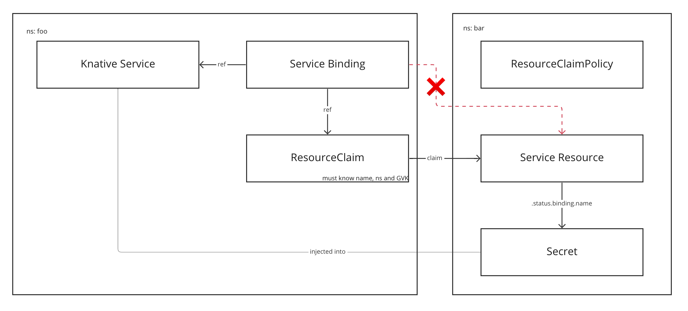
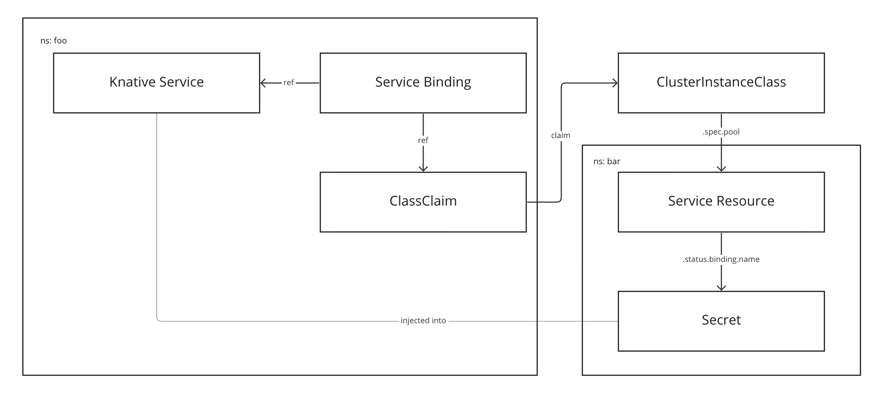
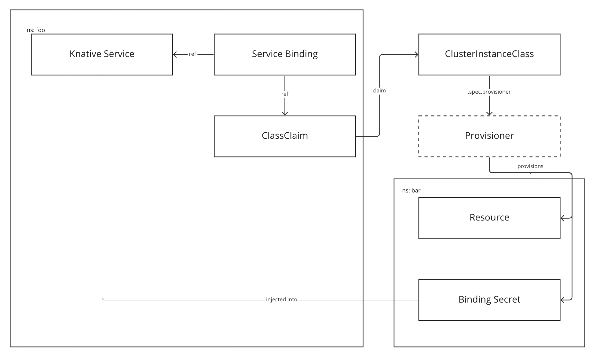

# Services Toolkit <!-- omit from toc -->

- [Resource Claims](#resource-claims)
- [Class Claims](#class-claims)
- [Dynamic Provisioning](#dynamic-provisioning)
- [Validation](#validation)
---

TAP 1.5 includes very detailed [documentation](https://docs.vmware.com/en/VMware-Tanzu-Application-Platform/1.5/tap/services-toolkit-about.html) on Services Toolkit, its concepts and capabilities. Especially the chapter on the [levels of service consumption](https://docs.vmware.com/en/VMware-Tanzu-Application-Platform/1.5/tap/services-toolkit-concepts-service-consumption.html) should be read throughly before proceeding.

If you reached this chapter by following the guide step by step, you now have the following:

1. TAP running on a single node Kubernetes cluster
2. A Kubernetes extension that allows you to lifecycle services (Tanzu SQL, Tanzu RabbitMQ, Crossplane, Config Connector, etc)
3. At least one service instance in a `Namespace` called `service-instances`

The following chapters refer to the levels of service consumption as described in the documentation referenced above and gives detailed instructions on how to implement each with the setup we have.

## Resource Claims

In order to allow app teams to create a `ResourceClaim` in their developer `Namespace` that claims our service resource, we need to create a `ResourceClaimPolicy` which exposes the service resource to the developer `Namespace`. This way, app teams can claim that specific service instance.


[Source](https://docs.vmware.com/en/VMware-Tanzu-Application-Platform/1.5/tap/services-toolkit-concepts-service-consumption.html)

Create `ResourceClaimPolicy` that exposes all `Postgres` resources to all `Namespace`s:

```
cat <<EOF | kubectl -n service-instances apply -f -
apiVersion: services.apps.tanzu.vmware.com/v1alpha1
kind: ResourceClaimPolicy
metadata:
  name: postgres-to-all
spec:
  subject:
    kind: Postgres
    group: sql.tanzu.vmware.com
    selector:
      matchLabels:
        app: postgres
  consumingNamespaces: [ "*" ]
EOF
```

## Class Claims

While in level 2, app teams claimed a specific service instances, they merely claim a `ClusterInstanceClass`. That class has a pool of service instances and the app team will receive a free service instance that matches their requirements. Instead of a `ResourceClaim` the app team creates a `ClassClaim`.


[Source](https://docs.vmware.com/en/VMware-Tanzu-Application-Platform/1.5/tap/services-toolkit-concepts-service-consumption.html)

1. Create the `ClusterInstanceClass`:

    ```
    cat <<EOF | kubectl apply -f -
    apiVersion: services.apps.tanzu.vmware.com/v1alpha1
    kind: ClusterInstanceClass
    metadata:
      name: postgres
    spec:
      description:
        short: "PostgreSQL Databases"
      pool:
        group: sql.tanzu.vmware.com
        kind: Postgres
    EOF
    ```
2. Create `ClusterRole` to allows access to that `ClusterInstanceClass`

    ```
    cat <<EOF | kubectl apply -f -
    apiVersion: rbac.authorization.k8s.io/v1
    kind: ClusterRole
    metadata:
      name: app-operator-claim-class-postgres
      labels:
        apps.tanzu.vmware.com/aggregate-to-app-operator-cluster-access: "true"
    rules:
    - apiGroups:
      - services.apps.tanzu.vmware.com
      resources:
      - clusterinstanceclasses
      resourceNames:
      - postgres
      verbs:
      - claim
    EOF
    ```

3. Create `ClusterRoleBinding` to `ClusterRole`
   
    In the step before, we set the label `apps.tanzu.vmware.com/aggregate-to-app-operator-cluster-access` to `true` which aggregates our rules into the `ClusterRole` called "app-operator-cluster-access". While we could now bind the user to the specific `ClusterRole` created before, we may also bind to "app-operator-cluster-access" to gain wider access to `ClusterInstanceClass`es.

    1. Find your user name

        If your cluster has `APISelfSubjectReview` enable, run

        ```
        kubectl auth whoami
        ```

        Otherwise, attempt to create a `ClassClaim` and the resulting error message will reveal your user name:

        ```
        tanzu -n test service class-claim create petclinic-db --class redit-unmanaged
        ```
        Expected output:
        ```
        Creating claim 'petclinic-db' in namespace 'test'.
        Error: admission webhook "vclassclaim.validation.resourceclaims.services.apps.tanzu.vmware.com" denied the request: user 'mathiase@vmware.com' cannot 'claim' from clusterinstanceclass 'redit-unmanaged'
        ```

    2. Create the `ClusterRoleBinding`

        ```
        USERNAME="..."
        ```
        ```
        cat <<EOF | kubectl apply -f -
        apiVersion: rbac.authorization.k8s.io/v1
        kind: ClusterRoleBinding
        metadata:
          name: mathiase-to-app-operator-cluster-access
        subjects:
        - kind: User
          name: "$USERNAME"
          apiGroup: rbac.authorization.k8s.io
        roleRef:
          kind: ClusterRole
          name: app-operator-cluster-access
          apiGroup: rbac.authorization.k8s.io
        EOF
        ```

## Dynamic Provisioning

While in level 3, the `ClusterInstanceClass` had an explicitly defined pool of **existing** service instances, level 4 introduces a provisioner in that place. The provisioner will dynamically provision service instances as claimed via the `ClusterInstanceClass`


[Source](https://docs.vmware.com/en/VMware-Tanzu-Application-Platform/1.5/tap/services-toolkit-concepts-service-consumption.html)

## Validation

While this step is normally a typcial step you would take as a platform engineer, let us validate the mechanism by spinning up a service and binding it to out `ResourceClaim`. 


1. Create a developer `Namespace`
    ```
    kubectl create ns --dry-run=client -o yaml test | kubectl apply -f -
    kubectl label namespaces test apps.tanzu.vmware.com/tap-ns=""
    ```

2. Discover available services

    1. If the service is exposed via `ResourceClaimPolicy`

        In this case, available services instances cannot be discovered. You will need to know that values used in the next step.

        </br>

    2. If the service is exposed via `ClusterInstanceClass`

        ```
        tanzu services classes list
        ```
        Expected output:
        ```
        NAME                  DESCRIPTION
        mysql-unmanaged       MySQL by Bitnami
        postgres              PostgreSQL Databases    <--- This is ours!
        postgresql-unmanaged  PostgreSQL by Bitnami
        rabbitmq-unmanaged    RabbitMQ by Bitnami
        redis-unmanaged       Redis by Bitnami
        ```

3. Claim the service

    1. If the service is exposed via `ResourceClaimPolicy`

        ```
        tanzu service resource-claim create petclinic-db \
          -n test \
          --resource-api-version sql.tanzu.vmware.com/v1 \
          --resource-kind Postgres \
          --resource-name pg-1 \
          --resource-namespace service-instances
        ```
        Validate the successful claim
        ```
        tanzu -n test services resource-claim list 
        ```
        Expected output:
        ```
        NAME          READY  REASON
        petclinic-db  True   Ready
        ```

    2. If the service is exposed via `ClusterInstanceClass`

        ```
        tanzu -n test service class-claim create petclinic-db --class postgres        
        ```
        Validate the successful claim
        ```
        tanzu -n test services class-claim list 
        ```
        Expected output:
        ```
        NAME          READY  REASON
        petclinic-db  True   Ready
        ```

4. Create a `Workload` with a service reference

    The `--service-ref` parameter create the binding with the service by referencing the `ResourceClaim` or `ClassClaim` created earlier.

    ```
    tanzu apps workload create petclinic -n test \
      -l "app.kubernetes.io/part-of=petclinic" \
      -l "apps.tanzu.vmware.com/workload-type=web" \
      -l "apps.tanzu.vmware.com/has-tests=true" \
      --build-env "BP_JVM_VERSION=17" \
      --git-repo https://github.com/spring-projects/spring-petclinic.git \
      --git-branch main \
      # PICK ONE:
      # --service-ref "database=services.apps.tanzu.vmware.com/v1alpha1:ClassClaim:petclinic-db"
      # --service-ref "database=services.apps.tanzu.vmware.com/v1alpha1:ResourceClaim:petclinic-db"
    ```

5. Note that `tanzu apps workload get` now displays a "Services" section with the reflective service reference (`ClassClaim` in the example below)

    ```
    tanzu apps workload get petclinic --namespace test
    ```
    Expected output
    ```
    🔁 Services
      CLAIM      NAME           KIND         API VERSION
      database   petclinic-db   ClassClaim   services.apps.tanzu.vmware.com/v1alpha1
    ```